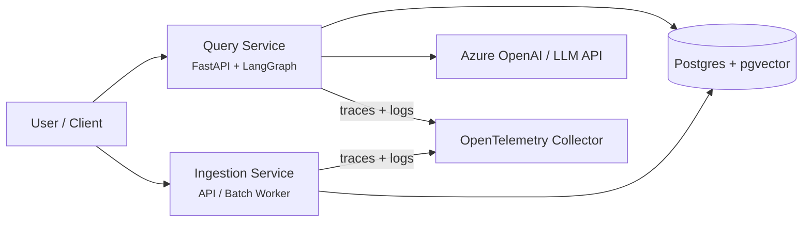
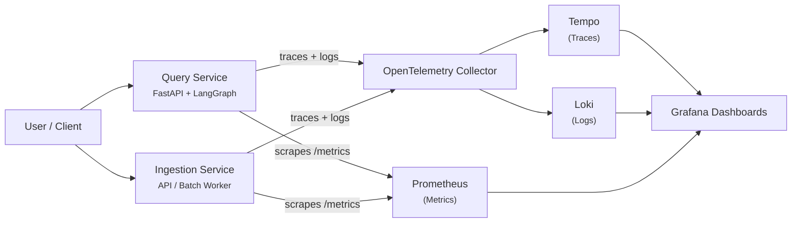

# Production RAG Reference Implemenation

Production-grade RAG system showcasing ingestion & query pipelines, observability, and Azure deployment.

---

## Milestones

| Phase | Focus                                                                           | Status         |
| ----- | ------------------------------------------------------------------------------- | -------------- |
| **1** | Foundation — monorepo structure, architecture definition                        | 🟢 Done        |
| **2** | Ingestion Pipeline — chunking, embeddings, pgvector storage                     | 🟢 Done        |
| **3** | Query Pipeline — LangGraph RAG workflow, `/query` endpoint                      | 🟢 Done        |
| **4** | Observability — OpenTelemetry tracing, Prometheus metrics, Grafana, Tempo, Loki | 🟢 Done        |
| **5** | Testing & Evaluation — unit tests, integration tests, RAG evaluation framework  | 🔵 In Progress |
| **6** | CI/CD — GitHub Actions (lint, test, build, evaluation)                          | 🟡 Planned     |
| **7** | Deployment — Terraform on Azure + AWS, managed Postgres                         | 🟡 Planned     |
| **8** | Documentation & Polish — final diagrams, onboarding docs, demo workflows        | 🟡 Planned     |

---

## Architecture Overview

This system is designed as a production-style Retrieval-Augmented Generation (RAG) architecture with clear separation of concerns across four layers:

- Application Layer (services)
- Data Layer (storage & retrieval)
- AI Layer (LLM & embeddings)
- Observability Layer (metrics, logs, traces)

### System Architecture Diagram

---

## 1. Application Layer

This layer contains the core services responsible for interacting with users and processing data.

### Components

- **Query Service (FastAPI + LangGraph)**
  - Handles user queries
  - Orchestrates retrieval and generation workflow
  - Returns grounded responses with sources
  - See detailed design and usage: [`services/query-service/README.md`](services/query-service/README.md)

- **Ingestion Service (API → Batch Worker)**
  - Processes incoming documents
  - Performs chunking and embedding generation
  - Stores processed data in the data layer
  - See detailed design and usage: [`services/ingestion-service/README.md`](services/ingestion-service/README.md)

---

## 2. Data Layer

This layer stores all structured and unstructured RAG data.

### Components

- **Postgres + pgvector**
  - Stores document chunks
  - Stores embedding vectors
  - Stores metadata for filtering and retrieval

---

## 3. AI Layer

This layer provides all model capabilities required for retrieval and generation.

### Components

- **LLM API (Azure OpenAI / OpenAI)**
  - Generates final responses
  - Used in query service for answer synthesis

- **Embedding Model**
  - Converts text into vector representations
  - Used in both ingestion and query pipelines

---

## 4. Observability Layer

This layer provides full visibility into system behavior, performance, and failures across two separate data flows.

**Traces and logs** are pushed by both services to the OpenTelemetry Collector over OTLP/gRPC. The collector fans them out — traces to Tempo, logs to Loki.

**Metrics** bypass the collector entirely. Each service exposes a `GET /metrics` endpoint (via `prometheus-fastapi-instrumentator`), and Prometheus scrapes those endpoints directly on a 15-second interval.

Grafana sits in front of all three backends (Tempo, Loki, Prometheus) as a unified query and dashboard layer.

### Components

- **OpenTelemetry Collector** — receives and routes traces and logs only; does not handle metrics
- **Tempo** — distributed tracing backend; receives traces from the OTel Collector
- **Loki** — log aggregation backend; receives structured logs from the OTel Collector
- **Prometheus** — metrics backend; scrapes `/metrics` from each service directly
- **Grafana** — unified dashboard for all three signals

### Observability Components Diagram

_Arrows show data flow direction. Prometheus **scrapes** `/metrics` from each service on a 15-second interval (pull model). Grafana **queries** Tempo, Loki, and Prometheus to build dashboards (pull model)._

---
