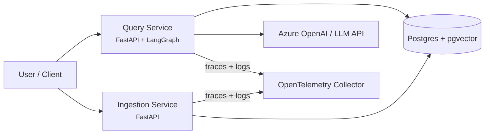
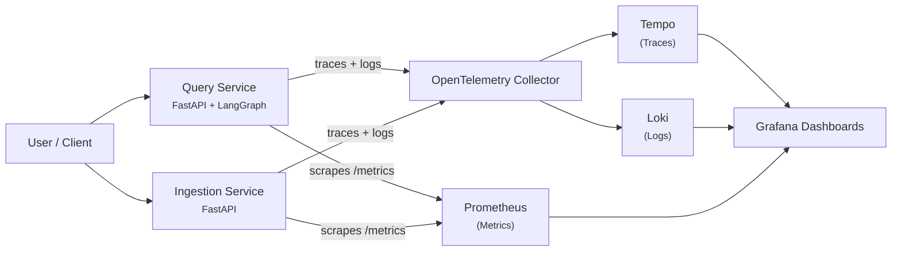

# Production RAG Reference Implemenation

[](https://github.com/jsandino/production-rag-system/actions/workflows/ci.yml) &nbsp;&nbsp; [📊 Latest Eval Report](https://jsandino.github.io/production-rag-system/)

This project shows what a Retrieval-Augmented Generation (RAG) system looks like in production, not just in a notebook. RAG is the technology behind AI assistants that answer questions using your own documents. Most reference implementations stop at a prototype — this one is built, tested, and observed the way a real system would be.

Two independent services handle ingestion and querying. Retrieval runs through a LangGraph pipeline backed by Postgres+pgvector. Every request is traced, measured, and logged with OpenTelemetry into Grafana. Answer quality is scored automatically with RAGAS, and CI fails the build if it drops.

---

## Quick Start

```bash
export OPENAI_API_KEY=your_key_here
make docker-up     # builds and starts everything
make docker-ingest # smoke-test ingestion
make docker-query  # smoke-test query
```

| Service | URL |
|---|---|
| Ingestion API | http://localhost:8000 |
| Query API | http://localhost:8001 |
| Grafana | http://localhost:3000 |
| Prometheus | http://localhost:9090/targets |

Full local (non-Docker) setup and dependency management: [docs/development.md](docs/development.md).

---

## Architecture Overview

This system is designed as a production-style Retrieval-Augmented Generation (RAG) architecture with clear separation of concerns across four layers:

- Application Layer (services)
- Data Layer (storage & retrieval)
- AI Layer (LLM & embeddings)
- Observability Layer (metrics, logs, traces)

### System Architecture Diagram


```mermaid
flowchart LR

User[User / Client]
IngestService["Ingestion Service<br/><small>FastAPI</small>"]
QueryService["Query Service<br/><small>FastAPI + LangGraph</small>"]
LLM[Azure OpenAI / LLM API]
Postgres[(Postgres + pgvector)]
OTEL[OpenTelemetry Collector]

User --> QueryService
User --> IngestService
QueryService --> Postgres
IngestService -->|traces + logs| OTEL
IngestService --> Postgres
QueryService --> LLM
QueryService -->|traces + logs| OTEL

LLM ~~~ Postgres
```

---

## 1. Application Layer

This layer contains the core services responsible for interacting with users and processing data.

### Components

- **Ingestion Service**
  - Processes incoming documents
  - Performs chunking and embedding generation
  - Stores processed data in the data layer
  - See detailed design and usage: [`services/ingestion-service/README.md`](services/ingestion-service/README.md)

- **Query Service (FastAPI + LangGraph)**
  - Handles user queries
  - Orchestrates retrieval and generation workflow
  - Returns grounded responses with sources
  - See detailed design and usage: [`services/query-service/README.md`](services/query-service/README.md)

---

## 2. Data Layer

This layer stores all structured and unstructured RAG data.

### Components

- **Postgres + pgvector**
  - Stores document chunks
  - Stores embedding vectors
  - Stores metadata for filtering and retrieval

---

## 3. AI Layer

This layer provides all model capabilities required for retrieval and generation.

### Components

- **LLM API (Azure OpenAI / OpenAI)**
  - Generates final responses
  - Used in query service for answer synthesis

- **Embedding Model**
  - Converts text into vector representations
  - Used in both ingestion and query pipelines

---

## 4. Observability Layer

This layer provides full visibility into system behavior, performance, and failures across two separate data flows.

**Traces and logs** are pushed by both services to the OpenTelemetry Collector over OTLP/gRPC. The collector fans them out — traces to Tempo, logs to Loki.

**Metrics** bypass the collector entirely. Each service exposes a `GET /metrics` endpoint (via `prometheus-fastapi-instrumentator`), and Prometheus scrapes those endpoints directly on a 15-second interval.

Grafana sits in front of all three backends (Tempo, Loki, Prometheus) as a unified query and dashboard layer.

### Components

- **OpenTelemetry Collector** — receives and routes traces and logs only; does not handle metrics
- **Tempo** — distributed tracing backend; receives traces from the OTel Collector
- **Loki** — log aggregation backend; receives structured logs from the OTel Collector
- **Prometheus** — metrics backend; scrapes `/metrics` from each service directly
- **Grafana** — unified dashboard for all three signals

### Observability Components Diagram


```mermaid
flowchart LR

User[User / Client]
IngestService["Ingestion Service<br/><small>FastAPI</small>"]
QueryService["Query Service<br/><small>FastAPI + LangGraph</small>"]
OTEL[OpenTelemetry Collector]
Tempo["Tempo<br/><small>(Traces)</small>"]
Loki["Loki<br/><small>(Logs)</small>"]
Prometheus["Prometheus<br/><small>(Metrics)</small>"]
Grafana[Grafana Dashboards]

User --> QueryService
User --> IngestService
QueryService -->|traces + logs| OTEL
IngestService -->|traces + logs| OTEL
OTEL --> Tempo
OTEL --> Loki
QueryService -->|scrapes /metrics| Prometheus
IngestService -->|scrapes /metrics| Prometheus
Tempo --> Grafana
Loki --> Grafana
Prometheus --> Grafana
```

_Arrows show data flow direction. Prometheus **scrapes** `/metrics` from each service on a 15-second interval (pull model). Grafana **queries** Tempo, Loki, and Prometheus to build dashboards (pull model)._

---

## Milestones

| Milestone | Focus                                                                           | Status         |
| --------- | ------------------------------------------------------------------------------- | -------------- |
| **1** | Foundation — monorepo structure, architecture definition                        | 🟢 Done        |
| **2** | Ingestion Pipeline — chunking, embeddings, pgvector storage                     | 🟢 Done        |
| **3** | Query Pipeline — LangGraph RAG workflow, `/query` endpoint                      | 🟢 Done        |
| **4** | Observability — OpenTelemetry tracing, Prometheus metrics, Grafana, Tempo, Loki | 🟢 Done        |
| **5** | Testing & Evaluation — unit tests, integration tests, RAG evaluation framework  | 🟢 Done        |
| **6** | CI/CD — GitHub Actions (lint, test, build, evaluation)                          | 🟢 Done        |
| **7** | RAGAS Integration — production-grade RAG evaluation                             | 🟢 Done        |
| **8** | Documentation & Polish — final diagrams, onboarding docs, demo workflows        | 🔵 In Progress |

---

## 5. Testing & Evaluation

Three testing layers, each with its own scope and isolation strategy: fast unit tests against injected fakes, integration tests against a real Postgres+pgvector via testcontainers, and end-to-end RAG evaluation. The eval layer runs the full stack in Docker and scores every answer with [RAGAS](https://docs.ragas.io/en/stable/) — faithfulness, context recall, context precision, and answer relevancy — gating CI at an 80% threshold per metric.

```bash
make test              # unit tests across all services + shared
make test-int          # integration tests (requires Docker for testcontainers)
make eval              # full RAG evaluation (requires Docker + OPENAI_API_KEY)
```

See [docs/testing.md](docs/testing.md) for test-layer details, design rationale, and the eval workflow.

---

## Learn more

- [docs/README.md](docs/README.md) — project knowledge index: monorepo layout, key source paths, and links to everything below
- [docs/decisions/README.md](docs/decisions/README.md) — architecture decision records, with the reasoning behind each one
- [docs/development.md](docs/development.md) — local and Docker development workflow
- [docs/testing.md](docs/testing.md) — testing philosophy, commands, and file map
