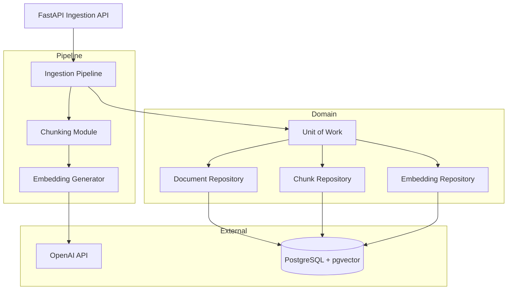
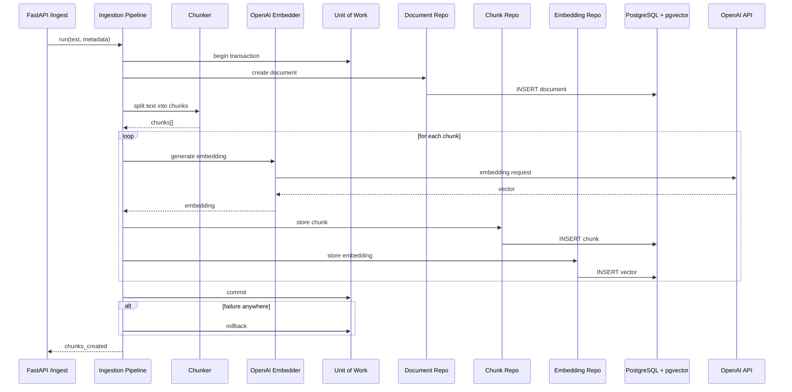
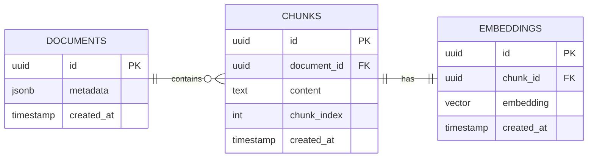

# Ingestion Service

## Overview

The ingestion-service is the entry point of a local-first Retrieval-Augmented Generation (RAG) system.

It is responsible for transforming raw text documents into structured, query-ready representations stored in PostgreSQL with pgvector support.

The service implements a production-style ingestion pipeline that includes:

- Document persistence
- Text chunking
- Embedding generation using OpenAI
- Storage of embeddings in a vector-enabled PostgreSQL database

The current implementation focuses exclusively on ingestion correctness, transactional safety, and reproducibility in a fully containerized local environment.

This service is designed to be the foundation for a later retrieval and ranking system in the RAG architecture.

## Architecture

The ingestion-service follows a layered architecture with clear separation between API, pipeline, embeddings, and persistence layers.

It is designed to ensure testability, replaceable components, and transactional consistency through a Unit of Work pattern.



## Ingestion Pipeline

The ingestion pipeline is responsible for converting raw text input into structured, embedded representations stored in PostgreSQL.

It is executed synchronously through the FastAPI ingestion endpoint and operates within a single transactional boundary enforced by the Unit of Work pattern.

### Execution Flow

The ingestion pipeline executes as a single transactional workflow coordinated by the Unit of Work:



**Key Guarantees**

- Entire ingestion is atomic (all-or-nothing)
- Chunks and embeddings are always consistent with the source document
- Failures in embedding generation or DB writes trigger rollback
- Pipeline is stateless and horizontally scalable

## Database Schema

The system uses a simple relational model to support document ingestion and future retrieval workloads.

The design centers around a document → chunk → embedding hierarchy.



**Design Intent**

- DOCUMENTS → CHUNKS (1-to-many)

  A single document is split into multiple chunks.

- CHUNKS → EMBEDDINGS (1-to-1 currently)

  Each chunk has one embedding vector (future: could evolve to multi-embedding strategies).

- The model is intentionally minimal to support:
  - ingestion correctness
  - future vector search (RAG retrieval phase)
  - easy schema evolution

## Local Development

The ingestion-service supports two development modes:

- **Docker-based (recommended)** — fully reproducible, production-aligned environment
- **Local Python execution** — faster iteration for development

### Prerequisites

- Docker
- Docker Compose
- Python 3.11+
- OpenAI API key

### Option 1 — Docker (Recommended)

All Docker commands are executed via the root Makefile and can be run from this directory.

### Set environment variable

Export your OpenAI API key:

```bash
export OPENAI_API_KEY=your_key_here
```

### Start the system

```bash
make docker-up
```

This will start:

- ingestion-service (FastAPI)
- PostgreSQL 17 with pgvector
- automatic schema initialization

### Run ingestion test

```bash
make docker-ingest
```

### Access services

Once running:

- API: http://localhost:8000
- Swagger UI: http://localhost:8000/docs

### Database access

```bash
make docker-db
```

### Stop system

```bash
make docker-down
```

### Reset system (fresh database)

```bash
make docker-reset
```

This will reinitialize the database schema from scratch.

### Option 2 — Local Python Execution

Run the ingestion-service without Docker for faster iteration.

### Install dependencies

```bash
make install
```

### Initialize project

```bash
make init
```

### Run the service

```bash
make run
```

Service will be available at:

- http://localhost:8001

### Test ingestion endpoint

```bash
make curl
```

**Notes**

- Local mode assumes a running PostgreSQL instance
- Docker mode is the source of truth for reproducibility

## API Usage

The ingestion-service exposes a single endpoint for document ingestion.

### Endpoint

```bash
POST /ingest
```

### Request Body

```json
{
  "document_id": "string",
  "text": "string",
  "metadata": {}
}
```

- `document_id`: unique identifier for the document
- `text`: raw text to ingest
- `metadata`: optional JSON metadata

### Example Request

Using curl:

```bash
curl -X POST http://localhost:8000/ingest \
  -H "Content-Type: application/json" \
  -d '{
    "document_id": "doc-1",
    "text": "This is a sample document for ingestion.",
    "metadata": {
      "source": "example"
    }
  }'
```

### Example Response

```json
{
  "status": "success",
  "chunks_created": 5
}
```

### Notes

- The ingestion process is transactional (all-or-nothing)
- Documents are split into chunks before embedding
- Embeddings are generated using OpenAI and stored in pgvector
