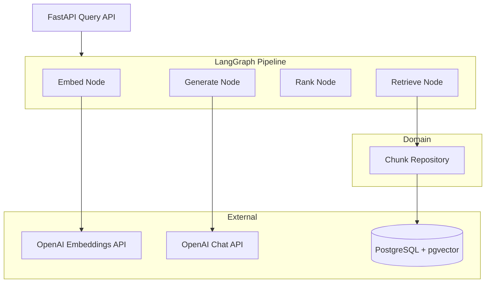
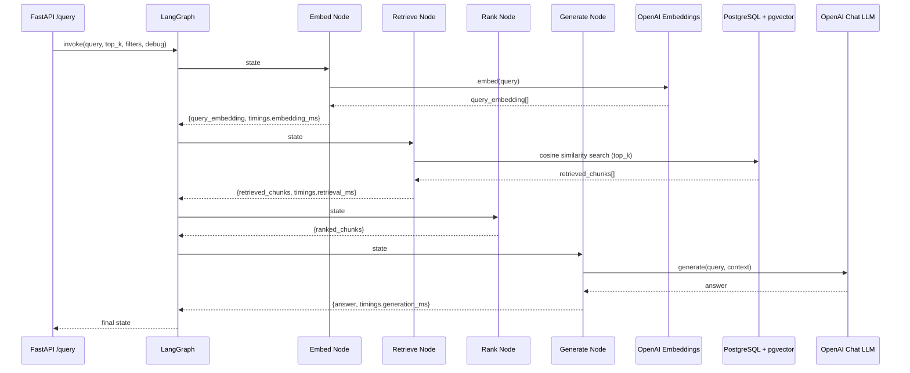
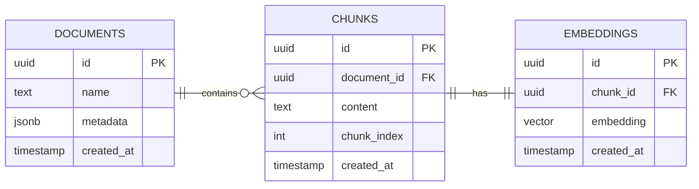

# Query Service

## Overview

The query-service is the retrieval and generation layer of a local-first Retrieval-Augmented Generation (RAG) system.

It is responsible for accepting natural language queries, retrieving relevant context from the vector knowledge base, and generating grounded answers using an LLM.

The service implements a production-style query pipeline that includes:

- Query embedding generation using OpenAI
- Vector similarity search via pgvector
- Score-based chunk ranking and filtering
- Answer generation using a chat LLM
- Optional debug output with per-node timing and intermediate results

The pipeline is orchestrated using LangGraph, providing a structured, node-level execution graph that forms the foundation for future observability instrumentation.

## Architecture

The query-service follows a layered architecture with clear separation between API, pipeline, retrieval, and generation layers.

It is designed to ensure testability and replaceable components through protocol-based abstractions for both the embedder and generator.



## Query Pipeline

The query pipeline is orchestrated as a directed LangGraph graph. Each node receives the full pipeline state and returns a partial update, which LangGraph merges before passing to the next node.

### Execution Flow



### Pipeline State

The full state object flowing through the graph:

```python
{
    # inputs
    "query": str,
    "top_k": int,
    "filters": dict,
    "debug": bool,

    # pipeline state
    "query_embedding": list[float] | None,
    "retrieved_chunks": list[ChunkResult],
    "ranked_chunks": list[ChunkResult],

    # output
    "answer": str | None,

    # observability
    "timings": dict,
}
```

### Node Responsibilities

| Node | Input | Output |
|---|---|---|
| `embed` | `query` | `query_embedding`, `timings.embedding_ms` |
| `retrieve` | `query_embedding`, `top_k` | `retrieved_chunks`, `timings.retrieval_ms` |
| `rank` | `retrieved_chunks` | `ranked_chunks` |
| `generate` | `ranked_chunks`, `query` | `answer`, `timings.generation_ms` |

**Ranking behaviour**

- Chunks scoring below `0.5` cosine similarity are filtered out
- If no chunks clear the threshold, the top result is kept as a fallback so generation always has at least some context

## Database Schema

The query-service reads from the same PostgreSQL database populated by the ingestion-service. No writes are performed.



## Local Development

The query-service supports two development modes:

- **Docker-based (recommended)** — fully reproducible, production-aligned environment
- **Local Python execution** — faster iteration for development

### Prerequisites

- Docker
- Docker Compose
- Python 3.11+
- OpenAI API key

### Option 1 — Docker (Recommended)

All Docker commands are executed via the root Makefile and can be run from this directory.

#### Set environment variable

```bash
export OPENAI_API_KEY=your_key_here
```

#### Start the system

```bash
make docker-up
```

This will start:

- ingestion-service (FastAPI, port 8000)
- query-service (FastAPI, port 8001)
- PostgreSQL 17 with pgvector
- automatic schema initialization

#### Ingest a document first

```bash
make docker-ingest
```

#### Run a query

```bash
make docker-query
```

#### Access services

Once running:

- Query API: http://localhost:8001
- Swagger UI: http://localhost:8001/docs

#### Database access

```bash
make docker-db
```

#### Stop system

```bash
make docker-down
```

#### Reset system (fresh database)

```bash
make docker-reset
```

### Option 2 — Local Python Execution

#### Install dependencies

```bash
make install
```

#### Initialize project

```bash
make init
```

#### Run the service

```bash
make run
```

Service will be available at http://localhost:8001.

#### Test query endpoint

```bash
make curl
```

**Notes**

- Local mode assumes a running PostgreSQL instance with data already ingested
- Docker mode is the source of truth for reproducibility

## Observability

The query-service is instrumented with OpenTelemetry. Each request produces a trace with the following span hierarchy:

```
POST /query                  ← root span (FastAPI auto-instrumentation)
  └── query.run
        ├── query.embed
        ├── query.retrieve
        ├── query.rank
        └── query.generate
```

Traces are exported via OTLP to the configured collector endpoint (`OTEL_EXPORTER_OTLP_ENDPOINT`).
Set `TELEMETRY_ENABLED=false` to disable tracing (e.g. during local dev without a collector).

---

## API Usage

The query-service exposes a single endpoint for RAG queries.

### Endpoint

```
POST /query
```

### Request Body

```json
{
  "query": "string",
  "top_k": 5,
  "filters": {},
  "debug": false
}
```

- `query`: natural language question
- `top_k`: number of chunks to retrieve (1–20, default 5)
- `filters`: reserved for future metadata filtering
- `debug`: if true, response includes per-node timings and intermediate chunks

### Example Request

```bash
curl -X POST http://localhost:8001/query \
  -H "Content-Type: application/json" \
  -d '{
    "query": "What is a vector database?",
    "top_k": 5,
    "filters": {},
    "debug": false
  }'
```

### Example Response

```json
{
  "answer": "A vector database stores and indexes high-dimensional vectors...",
  "sources": [
    {
      "chunk_id": "a3f1c2d4-...",
      "document_id": "b7e9f1a2-...",
      "document_name": "vector_databases_intro.pdf",
      "text": "A vector database indexes and stores vector embeddings...",
      "score": 0.91
    }
  ]
}
```

### Example Debug Response

```json
{
  "answer": "...",
  "sources": [...],
  "debug": {
    "embedding_ms": 12,
    "retrieval_ms": 45,
    "generation_ms": 320,
    "retrieved_chunks": [...],
    "ranked_chunks": [...]
  }
}
```
